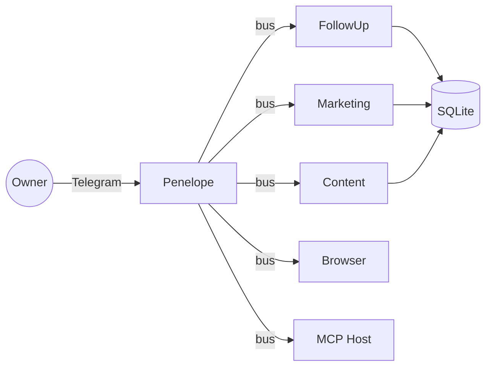

<div align="center">

# Penelope

**The autonomous business OS. Run your small business from a Telegram chat.**

[](https://github.com/Mushisushi28/penelope/actions/workflows/ci.yml)
[](LICENSE)
[](https://nodejs.org)
[](packages/)
[](https://github.com/Mushisushi28/penelope/releases)

[quickstart](docs/QUICKSTART.md) · [deploy guide](docs/DEPLOY.md) · [architecture](ARCHITECTURE.md) · [connectors](docs/CONNECTORS.md) · [contributing](CONTRIBUTING.md) · [faq](docs/FAQ.md)

</div>

---

Small business owners spend half their day in eight different apps: one for customer messages, one for invoices, one for scheduling, another for reviews, another for ads. Each one demands attention in a different tab.

Penelope collapses that into a single Telegram chat. You talk to your business the way you'd text a very competent employee. She handles the rest — routing customer messages, triggering follow-ups, dispatching content generation, keeping an audit trail — while you stay focused on the actual work.

## What Penelope does

- **Handles customer DMs** — replies to Facebook Page Messenger (24-hour-window aware), SMS, and Instagram (stub); escalates to you when a human decision is needed
- **Manages follow-ups** — detects dormant leads, drafts re-engagement messages within your approval rules, sends when you confirm
- **Generates content** — produces before/after imagery and short-form copy from job photos via FAL.ai and Nano Banana adapter stubs; schedules posts
- **Keeps marketing running** — Marketing specialist dispatches campaigns on the internal bus; no Ads Manager required
- **Tracks everything** — per-tenant audit log with a tamper-detect hash chain; memory layer scoped to user, session, and agent
- **Runs multiple businesses** — multi-tenant from day one; each tenant gets isolated secrets, bus, audit log, and dashboard
- **Exposes a dashboard** — Odysseus-themed vanilla JS PWA at `localhost:18900`; no separate login, tenant-branded

What is not shipped yet (roadmap): WhatsApp inbound, Instagram inbound beyond stub, per-tenant Stripe billing, Social/Finance/Team specialists.

## Quick start

```bash
git clone https://github.com/Mushisushi28/penelope.git
cd penelope
npm install
cp .env.example .env          # fill in your Telegram bot token
npm run start --workspace @penelope/cli
```

Full walkthrough with tenant setup: [docs/DEPLOY.md](docs/DEPLOY.md)

## Architecture

Penelope (head agent) is the only agent that talks to the owner on Telegram. She reads your message, decides what work needs doing, and dispatches to specialists on the internal loom-a2a bus. Specialists are bus-only — they never contact you directly. Each tenant is a directory under `tenants/<id>/` with its own SQLite bus, secrets file, procedures, and audit log.



Connector discovery runs a cascade: MCP server → hand-coded API skill → Hermes OpenAPI auto-loader → Stagehand browser specialist → computer-use. The cheapest path that works is the one Penelope uses.

## Specialists shipped

| Specialist | What it does |
|---|---|
| **FollowUp** | Detects dormant leads, drafts re-engagement, fires on schedule |
| **Marketing** | Campaign dispatch; no Ads Manager access required |
| **Content** | Before/after image generation (FAL.ai + Nano Banana stubs), post scheduling |
| **Browser** | Stagehand-based, sandboxed per tenant; used when no API exists |
| **MCP Host** | Loads up to 300+ MCP servers; tenants declare which ones they need |

## Connectors out of the box

Full catalog with tier and status in [docs/CONNECTORS.md](docs/CONNECTORS.md).

- **Messaging** — Facebook Page Messenger (T2 API-skill, full), WhatsApp Business (T2, full), Instagram DM (T2, stub), Telegram owner bot (per-tenant)
- **SMS** — Twilio (T2, stub), TextNow DOM (T4 browser, stub)
- **Payments** — Stripe via MCP (T1, full), Square (T2, stub)
- **Calendar** — Google Calendar (T1 MCP + T2, stub), Calendly (T3 Hermes, stub)
- **Email** — IMAP/SMTP (T2, stub), Gmail MCP (T1, stub)
- **OpenAPI (Hermes)** — register any service with an OpenAPI spec; no code required

## Packages

| Package | Role |
|---|---|
| `@penelope/core` | Tenant model, procedure YAML loader, Zod validation |
| `@penelope/agents` | Penelope head agent + specialists (FollowUp, Marketing, Content, Browser) |
| `@penelope/adapters` | Channel adapters: Telegram owner bot, FB Page, Twilio, IMAP/SMTP, Instagram, WhatsApp, loom-a2a |
| `@penelope/cli` | `penelope init / up / status / tenant / send / doctor` |
| `@penelope/dashboard` | Odysseus-themed PWA owner app, runs at localhost:18900 |
| `@penelope/hermes` | Auto-loads connectors from OpenAPI specs |
| `@penelope/memory` | mem0-style memory layer; user/session/agent scopes; Node 22 native sqlite |
| `@penelope/connector-discovery` | Connector cascade orchestrator |
| `@penelope/audit-log` | Append-only per-tenant tamper-detect log |
| `@penelope/secrets` | Per-tenant secrets loader |
| `@penelope/billing` | Billing hooks (managed tier, roadmap) |
| `@penelope/marketplace` | Community connector + procedure registry, sandbox-to-TOTP-promote |
| `@penelope/procedure-eval` | Replay harness for testing procedure/prompt changes against recorded threads |
| `@penelope/onboarding-web` | Next.js install wizard for non-CLI users |
| `@penelope/telemetry` | Opt-in usage meter (counts only, never content) |

## Reference tenant

`tenants/dhr/` is a working reference tenant for a mobile auto-service business (headlight restoration). It includes a `tenant.json` with brand config, pricing rules, and example procedures. Use it as the template for your first vertical.

Example vertical starters in `examples/`: `auto-service`, `home-services`, `personal-services`.

## Deploying your own tenant

See [docs/DEPLOY.md](docs/DEPLOY.md) for the full guide:
- Node 22 + sqlite + optional ffmpeg
- Clone, install, create tenant
- Configure Telegram bot via @BotFather
- Start and verify

## Self-host vs hosted

Self-hosting is free — clone the repo, run `npm install`, configure a tenant, start. A managed hosted tier (where Penelope runs on our infrastructure, billing per tenant) is on the roadmap but not available yet. For now, you own the stack.

## License

MIT. See [LICENSE](LICENSE).

## Security

Report vulnerabilities via [GitHub Security Advisories](https://github.com/Mushisushi28/penelope/security/advisories/new). Details in [SECURITY.md](SECURITY.md).

## Contributing

PRs welcome on bugs, new channel adapters, vertical templates, and procedure improvements. See [CONTRIBUTING.md](CONTRIBUTING.md).

---

Built on [Loom](https://github.com/Mushisushi28/loom), the private multi-agent engine that powers Penelope's bus, specialist dispatch, and tenant isolation.
